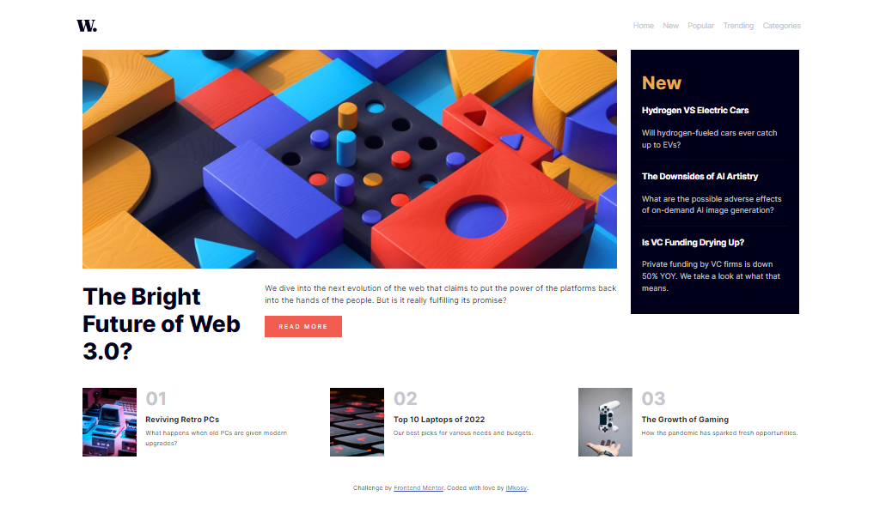

# Frontend Mentor - News homepage solution

This is a solution to the [News homepage challenge on Frontend Mentor](https://www.frontendmentor.io/challenges/news-homepage-H6SWTa1MFl). Frontend Mentor challenges help you improve your coding skills by building realistic projects. 

## Table of contents

- [Overview](#overview)
  - [The challenge](#the-challenge)
  - [Screenshot](#screenshot)
  - [Links](#links)
- [My process](#my-process)
  - [Built with](#built-with)
  - [What I learned](#what-i-learned)
  - [Continued development](#continued-development)
  - [Useful resources](#useful-resources)
- [Author](#author)

## Overview

### The challenge

Users should be able to:

- View the optimal layout for the interface depending on their device's screen size
- See hover and focus states for all interactive elements on the page

### Screenshot

### Links

- Solution URL: [Add solution URL here](https://your-solution-url.com)
- Live Site URL: [Add live site URL here](https://your-live-site-url.com)

## My process

### Built with

- Semantic HTML5 markup
- CSS custom properties
- Flexbox
- CSS Grid
- Bootstrap

### What I learned

The reason why frameworks were created was to ease stress for developers and also help them create vast projects in a short period of time. 
the creation of css frameworks like bootstrap made this possible and i appreciate it's existence.

### Continued development

i would love to go into creating amazing UI forms and also making secured form using javascript.

### Useful resources

- [Resource 1](https://www.bootstrap5.2.com) 
- [Resource 2](htmlsemantic) 

## Author

- Frontend Mentor - [@iMkosy](https://www.frontendmentor.io/profile/iMkosy)
- Twitter - [@ibewuba_k](https://www.twitter.com/ibewuba_k)

